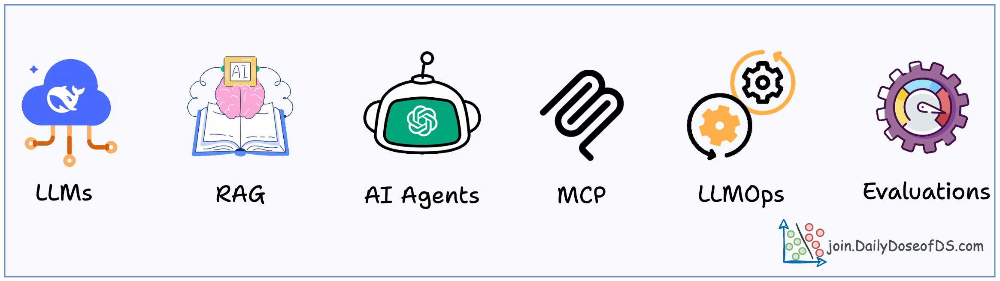

<!-- IU animation -->

   

### Languages
| Python | 
| ------ | ----------- | ----- | ---- | --------- | ------ | ----------------- | - | -- | ------ |
|  |  |  |  |  |  |  |  |  |  |  |  |

### Platforms
| Conda | Jupyter | VS Code |
|----------|----------|----------|
||||

<b>👀 Currently pursuing Bachalor of Engineering. computer engineering</b>  
<b>🌱 Based in **Pune**.</b>  
<b>🔭 - 💻 Enthusiastic about **Data Science**, **Machine Learning**,**Gen AI** </b>  
<b>💞️ I’m looking to collaborate on educational projects.</b>  
<b> 📈 Constantly learning and eager to tackle new challenges! 🚀.</b>  
<b>❤️ Favorite quote: "Love all, serve all. Help ever, hurt never."</b>

<b>🔭  🛠️ Skills,</b>  
<b>🔭 **Languages**: Mysql  ,Python 🐍,c++ ,</b>  
<b>**Libraries**: Pandas 📚, NumPy ➕, Matplotlib 🎨, Seaborn 🌊, Scikit-learn 📉</b>  
<b>**Tools**: Jupyter Notebook 📓, Git 🌐,.</b>  
<b>**Frameworks**: TensorFlow 🔗, Keras , MLOPS ,langchain , langgrapgh ⚙️</b>

<h1 align="center"> 📊 GitHub Stats: </h1>

  
  
  
  
 

  
  

  

<h2 align="center"> ✍️ Random Developer Quote </h2>

  

    

  

